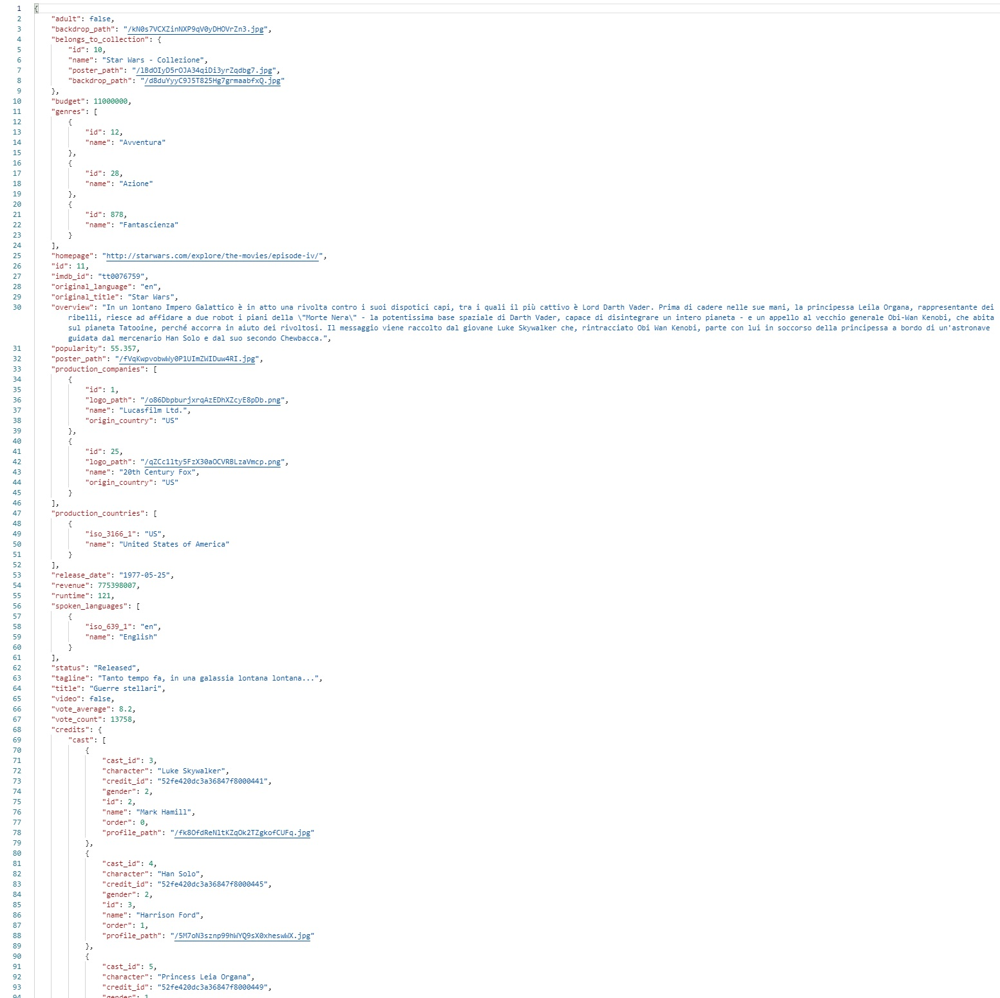
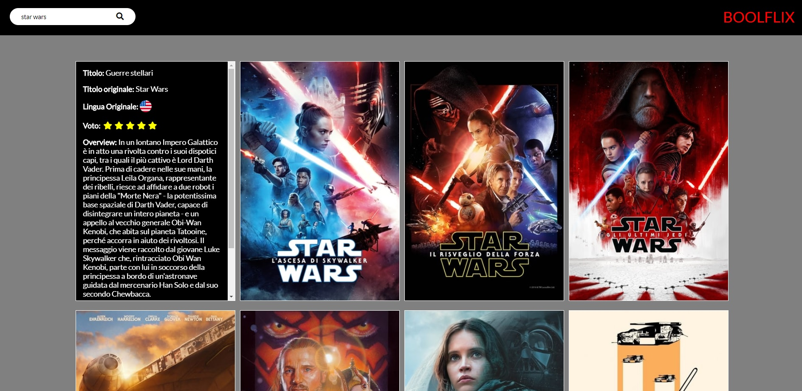
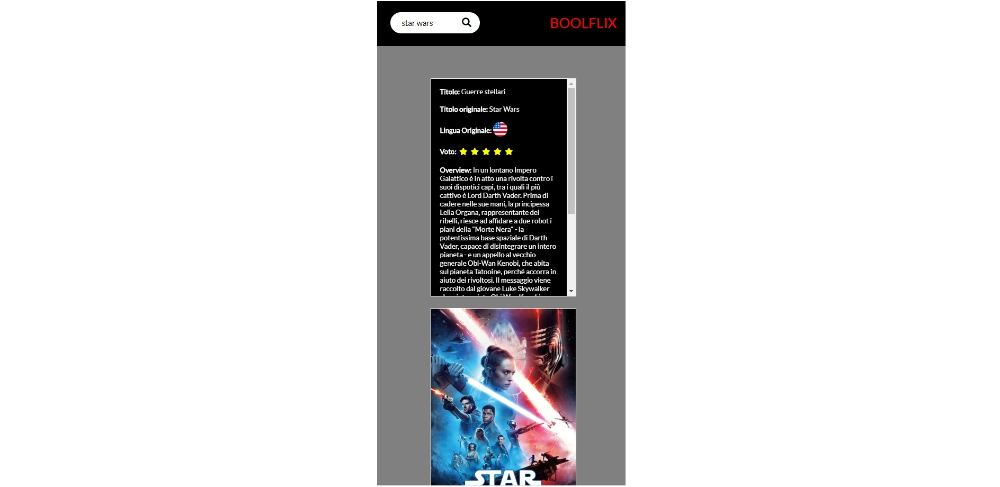

# Ajax-ex-boolflix
A website to get informations about films/tv Series.   

For example, search ‘Star Wars’ and you will get all the films/tv Series that include ‘Star Wars’ in the title. (thanks to the API of The Movie Database (TMDb)).  

Each card contains: the title in Italian, the original title, the original language (represented by the flag of the country), the score (represented by a maximum of 5 stars) and the overview.
When you hover the mouse on the card additional informations are loaded such as (up to 5) actors and genres.
The site supports mobile, tablet, and desktop sizes.  

HTML, CSS, JavaScript, jQuery, Handlebars.

***
### [Live Website](https://gianluigivitale.github.io/ajax-ex-boolflix/)
***
### Example-Film-Api-response:

### Preview-lg:

### Preview-xs:

